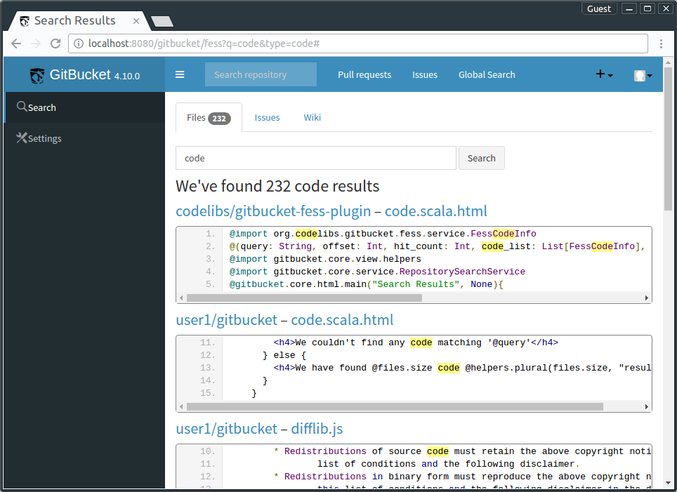
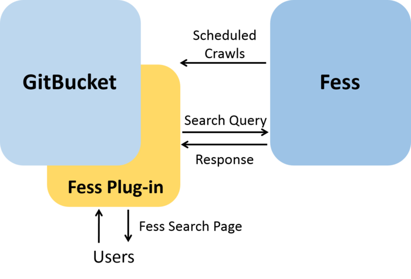
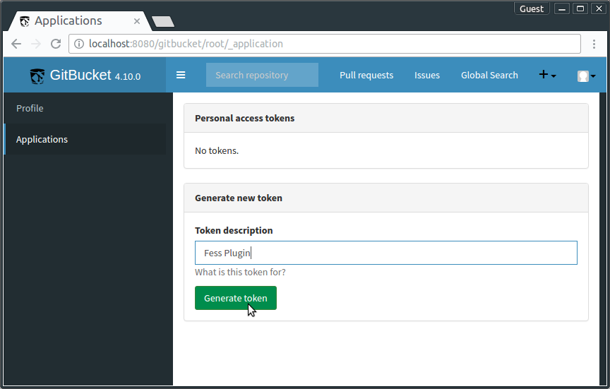
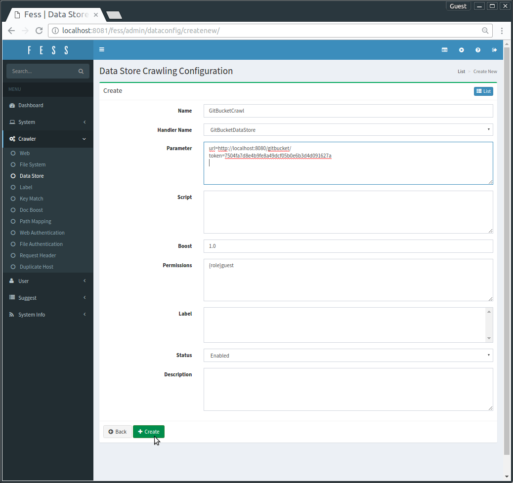
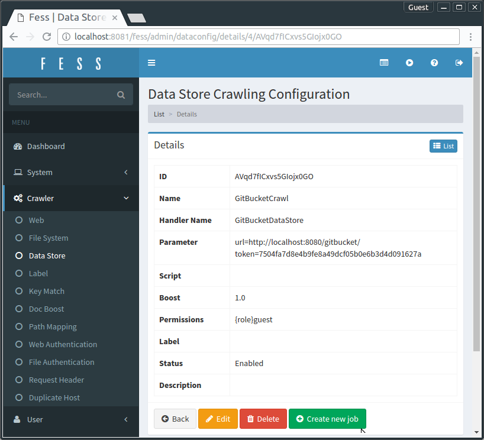
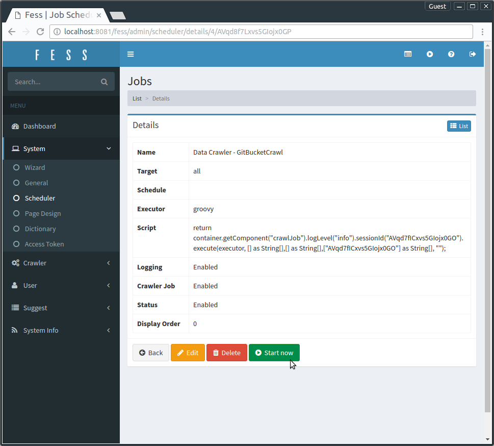
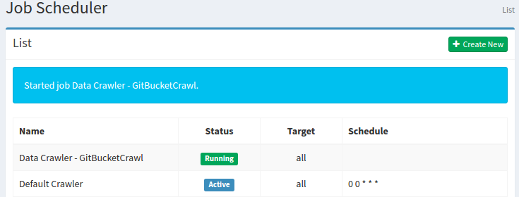
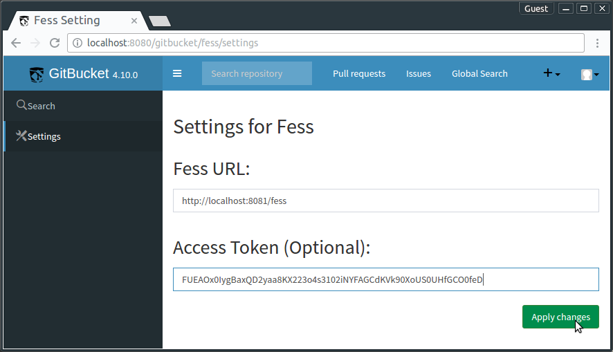
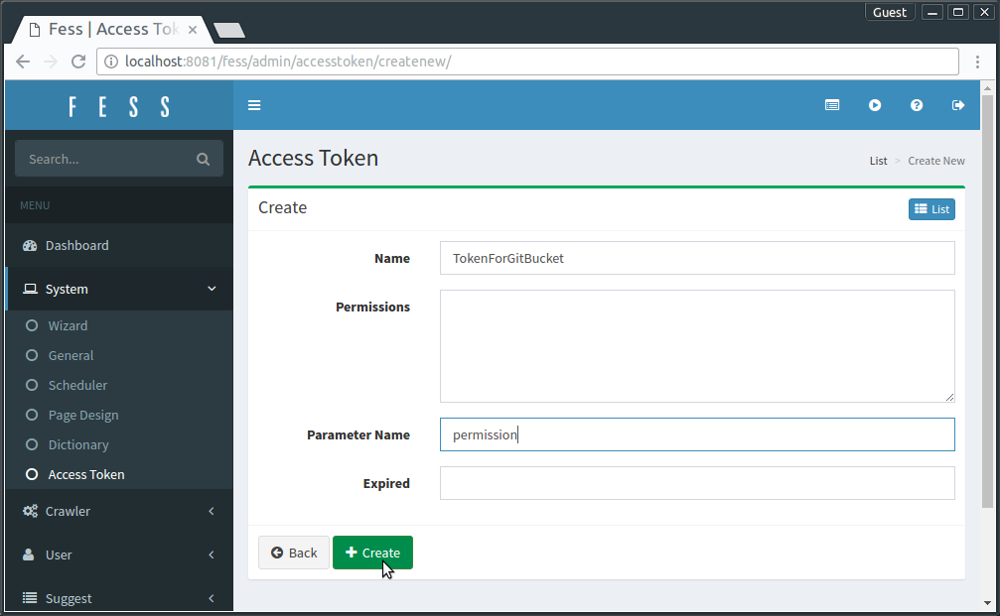
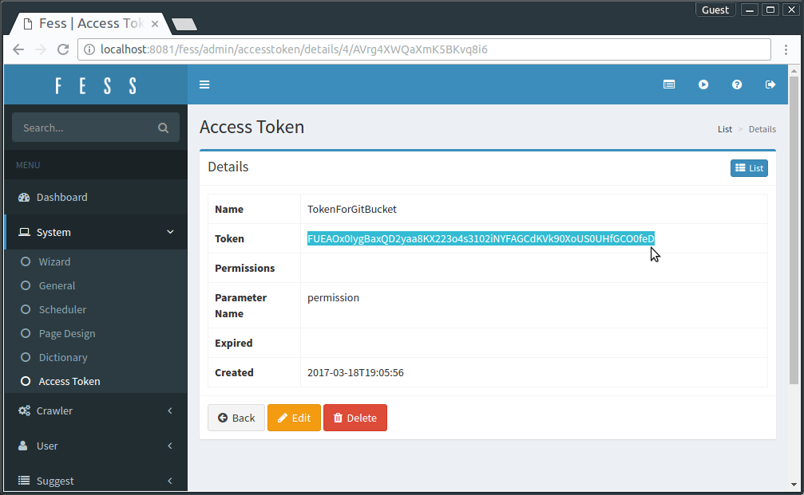

gitbucket-fess-plugin: Search All of GitBucket on Fess
==

[**gitbucket-fess-plugin**](https://github.com/codelibs/gitbucket-fess-plugin) is a [**GitBucket**](https://github.com/gitbucket/gitbucket) plugin that provides **global search**, that is, search across multiple repositories.

Users can search for:
* **Code** in all public repositories
* **Code** in private repositories where you can access
* **Issues** / **Pull requests**
* **Wiki** pages



This plugin cooperates with [**Fess**](https://github.com/codelibs/fess), which is a full-text search server powered by [**Elasticsearch**](https://www.elastic.co/products/elasticsearch).
But, special knowledge is NOT required to use both Fess and this plugin.



Why Fess?
--
* **open source** software provided under Apache license
* **easy to deploy**
* **powerful** search engine based on **Elasticsearch**
* can index/search documents in **30+ languages**
* supports **many file formats** (pdf, MS Office, etc.)


Links
--
* [Japanese Documentation](http://qiita.com/kw_udon/items/06d385b88dafed4bd609)

# Release

| Plugin version | GitBucket version | Fess version | jar File                                                                                                                                             |
|:--------------:|:-----------------:|:---------------:|:----------------------------------------------------------------------------------------------------------------------------------------------------:|
| 1.1.x          | 4.13, 4.12, 4.11  | 11.0.1 or later | [Download](http://central.maven.org/maven2/org/codelibs/gitbucket/gitbucket-fess-plugin_2.12/1.1.1/gitbucket-fess-plugin_2.12-1.1.1.jar)             |
| 1.0.0          | 4.10              | 11.0.1          | [Download](http://central.maven.org/maven2/org/codelibs/gitbucket/gitbucket-fess-plugin_2.12/1.0.0/gitbucket-fess-plugin_2.12-1.0.0.jar)             |
| 1.0.0-beta2    | 4.7               | 10.3            | [Download](http://central.maven.org/maven2/org/codelibs/gitbucket/gitbucket-fess-plugin_2.11/1.0.0-beta2/gitbucket-fess-plugin_2.11-1.0.0-beta2.jar) |
| 1.0.0-beta1    | 4.6               | 10.3            | [Download](http://central.maven.org/maven2/org/codelibs/gitbucket/gitbucket-fess-plugin_2.11/1.0.0-beta1/gitbucket-fess-plugin_2.11-1.0.0-beta1.jar) |

# Getting Started

* [Installation](#installation)
* [Setting Up](#setting-up)
* [Private Repository Search](#private-repository-search)
* [Continuous Crawl](#continuous-crawl)

## Installation
Download `gitbucket-fess-plugin` jar file from [the release page](https://github.com/codelibs/gitbucket-fess-plugin/releases) and
put it into `~/.gitbucket/plugins` (If the directory does not exist, create it by hand).

## Setting Up
After the installation, the admin user sets up both of GitBucket and Fess.

The flow of the setting is like the following:

* [Step 1. Run GitBucket and Fess](#step-1-run-gitbucket-and-fess)
* [Step 2. Generate Token for Crawler @GitBucket](#step-2-generate-token-for-crawler-gitbucket)
* [Step 3. Set up Crawler @Fess](#step-3-set-up-crawler-fess)
* [Step 4. Run Crawler @Fess](#step-4-run-crawler-fess)
* [Step 5. Register Fess's URL @GitBucket](#step-5-register-fesss-url-gitbucket)

### Step 1. Run GitBucket and Fess
Run [GitBucket](https://github.com/gitbucket/gitbucket) and [Fess](https://github.com/codelibs/fess).
If you run the both applications on `localhost`, use different port numbers.

#### Example
##### GitBucket: `http://localhost:8080/gitbucket/`
```bash
$ java -jar gitbucket.war --port=8080 --prefix=gitbucket
```

##### Fess: `http://localhost:8081/fess/`
```bash
$ ./bin/fess -Dfess.port=8081 -Dfess.context.path=/fess/
```


### Step 2. Generate Token for Crawler @GitBucket
Access to `http://[GitBucket URL]/[User Name]/_application` as a GitBucket's admin user and generate an access token.
This token will be used by crawlers of Fess.



### Step 3. Set up Crawler @Fess
Access to `http://[Fess URL]/admin/dataconfig/` as a Fess's admin user and set up a data crawler.

Then, fill each form as below:
* Name: String
* Handler Name: **GitBucketDataStore**
* Parameter:
```
url=http://[GitBucket URL]
token=[GitBucket's Token generated in Step 2]
```
You don't have to change other values.



After you create a configuration successfully, you can find it in `http://[Fess URL]/admin/dataconfig/`.
Then, click it and create a new crawling job.



You can set up a crawling schedule here, but you can also change it later.
Thus, if you are new to Fess,　you don't need to change any value here.
(For more details about scheduling, see [a later section](#continuous-crawl).)

### Step 4. Run Crawler @Fess
Move to `http://[Fess URL]/admin/scheduler/`.
Then, you will find the job created in Step 3 on the top of the list.
Choose and start it.



If a crawler starts successfully, the status of the job scheduler becomes *Running* like the following:



Crawling process takes time, depending on a number of contents in GitBucket.
After the crawling job finishes, you can search GitBucket's contents on Fess.

### Step 5. Register Fess's URL @GitBucket
This is the final step.
Access to `http://[GitBucket URL]/fess/settings` as an admin user and register the Fess URL.

You can also register a [Fess's access token](http://fess.codelibs.org/11.0/admin/accesstoken-guide.html) here.
It is required for private repository search, but you can leave this form empty now.
For more details, see [the next section](#private-repository-search).



Then, global search will be enabled!

## Private Repository Search
If the admin user registers a [Fess's access token](http://fess.codelibs.org/11.0/admin/accesstoken-guide.html) at `http://[GitBucket URL]/fess/settings`,
users can explore their private repositories.

**How to generate Fess's access token**

Access to `http://[Fess URL]/admin/accesstoken/` as an admin user and
click the `Create New` button.

Next, fill in the form like the following:
* Name: String
* Permissions: empty
* Parameter Name: **`permission`**



Then, access token will be created.




## Continuous Crawl
By setting up [job schedulers](http://fess.codelibs.org/11.0/admin/scheduler-guide.html) on Fess,
you can run data crawlers periodically to keep search results up to date.

Access to `http://[FessURL]/admin/scheduler/` and choose a crawler job.
Then, you can setting up the value of `Schedule` in [Cron-format](https://en.wikipedia.org/wiki/Cron).

# Development Information

## Build

```
$ ./sbt.sh package
```
 Please use `sbt.bat` instead on Windows.

## Code Format
```bash
$ ./sbt.sh scalafmt
```

# Contribution
Any contribution will be appreciated!
Please send [issues](https://github.com/codelibs/gitbucket-fess-plugin/issues) or [pull requests](https://github.com/codelibs/gitbucket-fess-plugin/pulls).
