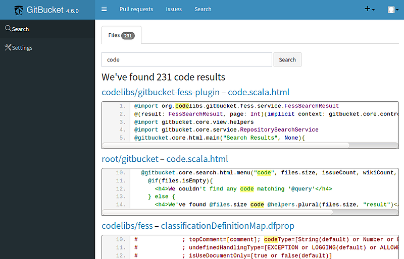

gitbucket-fess-plugin
==

This is a [GitBucket](https://github.com/gitbucket/gitbucket) plug-in that provides search functionality across multiple repositories.
This plug-in uses [Fess](https://github.com/codelibs/fess) as a backend search engine, so response times are much shorter than that of GitBucket's default search functionality.



# Requirement
* **GitBucket**: 4.6 or later
* **Fess**: 10.3 or later

# Release

| Version        | File                                                                                                                                                 |
|:--------------:|:----------------------------------------------------------------------------------------------------------------------------------------------------:|
| 1.0.0-beta1    | [Download](http://central.maven.org/maven2/org/codelibs/gitbucket/gitbucket-fess-plugin_2.11/1.0.0-beta1/gitbucket-fess-plugin_2.11-1.0.0-beta1.jar) |

# Getting Started

## Installation
Download gitbucket-fess-plugin jar file and copy the file to `~/.gitbucket/plugins` (If the directory does not exist, create its directory by hand).

We are planning to provide a jar file when the beta version is released.

## Setting Up
After the installation, the admin user has to set up both of GitBucket and Fess.

The flow of the setting is like the following:

1. Prepare GitBucket and Fess
2. **[GitBucket]** Generate an access token for Fess's crawler
3. **[Fess]** Set up a crawler for GitBucket repositories
4. **[Fess]** Run the crawler
5. **[GitBucket]** Register information about Fess

### Step 1. Prepare GitBucket and Fess
Run [GitBucket](https://github.com/gitbucket/gitbucket) and [Fess](https://github.com/codelibs/fess).
If you try to run the both application on `localhost`, be careful to use different port numbers.

### Step 2. **[GitBucket]** Generate an access token for Fess's crawler
Access `http://[GitBucket URL]/[User Name]/_application` as a GitBucket's admin user and generate an access token.
This token will be used by crawlers of Fess.

### Step 3. **[Fess]** Set up a crawler for GitBucket repositories
Access `http://[Fess URL]/admin/dataconfig/` as a Fess's admin user and create a [data store crawling configuration](http://fess.codelibs.org/10.3/admin/dataconfig-guide.html).

Then, fill each form as below:
* Name: Configuration name that you like
* Handler Name: **GitBucketDataStore**
* Parameter:
```
url=http://[GitBucket URL]
token=[Access Token generated in Step 2]
```
('[' and ']' are not included)
You don't have to change other values.

After you create a configuration successfully, you can find it in `http://[Fess URL]/admin/dataconfig/`.
Then, click it and create a new crawling job.

### Step 4. **[Fess]** Run the crawler
If you move to `http://[Fess URL]/admin/scheduler/`, you will find the newly created job in Step 3.
Then, start it.

After the crawling job finishes, you can search GitBucket's contents on Fess.

### Step 5. **[GitBucket]** Register information about Fess
This is the final step.
Access `http://[GitBucket URL]/fess/` as an admin user and register the URL of Fess.
In this page, you can also register a [Fess's access token](http://fess.codelibs.org/10.3/admin/accesstoken-guide.html). 
This token is used to search for private repositories.

Then, GitBucket users can access the search functionality powered by Fess!

# Development

## Build

Run `./sbt.sh package` (use sbt.bat instead on Windows).

